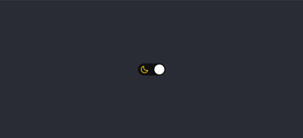
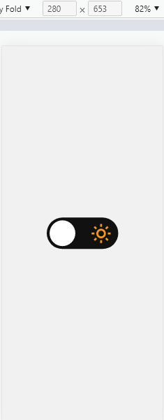
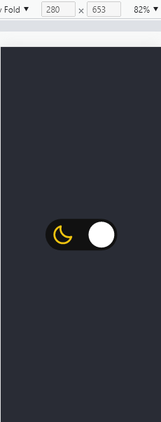

<h1 align='center'>Theme Switcher 🌙🌞</h1>

  <a href="#-sobre">Sobre</a>&nbsp;&nbsp;&nbsp;|&nbsp;&nbsp;&nbsp;
  <a href="#-prints">Prints</a>&nbsp;&nbsp;&nbsp;|&nbsp;&nbsp;&nbsp;
  <a href="#-tecnologias">Tecnologias</a>&nbsp;&nbsp;&nbsp;|&nbsp;&nbsp;&nbsp;
  <a href="#-licença">Licença</a>&nbsp;&nbsp;&nbsp;|&nbsp;&nbsp;&nbsp;

🚀 Projeto concluído ✅

## 💻 Sobre

Este projeto é um alternador de temas feito em HTML, CSS e JavaScript. Este projeto é mais um dos desafios propostos no Curso do Discover da Rocketseat. [Link para página do desafio](https://efficient-sloth-d85.notion.site/Desafio-Theme-Switcher-dbabdf77f70d43298df382c8e805fc13). No projeto é permitido alternar entre os temas claro e escuro e a opção do usuário é salva no localStorage do navegador.  

Clique [aqui](https://codepen.io/gustavo_victor/pen/PodmyqM) para conferir como o projeto ficou no Codepen.

## 📷 Prints

 

 

## 🛠 Tecnologias

- Linguagens: 
    - [HTML](https://developer.mozilla.org/pt-BR/docs/Web/HTML) 
    - [CSS](https://developer.mozilla.org/pt-BR/docs/Web/CSS)
    - [JavaScript](https://www.javascript.com/)
- Ferramentas / Recursos: 
    - Editor: [Visual Studio Code](https://code.visualstudio.com/)

## 📝 Licença 

O projeto está sob a [Licensa MIT](./LICENSE) 

Qualquer pessoa pode usar, clonar e contribuir com este projeto. 

